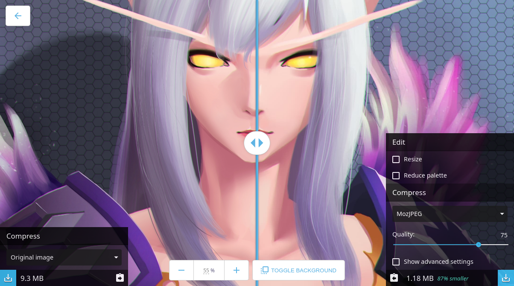
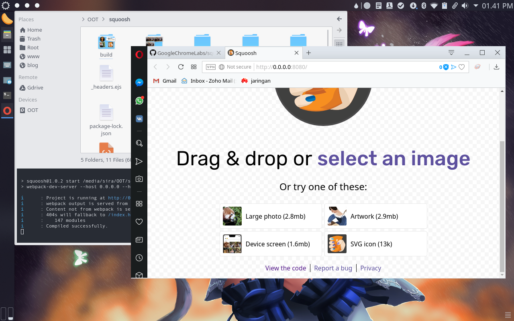

<div class="video-container"><iframe src="https://www.youtube.com/embed/ipNW6lJHVEs" frameborder="0" allowfullscreen></iframe></div>

## Pengantar

Squoosh merupakan kreasi dari Google Chrome Labs, yang diumumkan dan didemonstrasikan secara singkat saat Google Chrome Dev Summit 2018. Alat ini dapat mengambil gambar apa pun dan mengubahnya menjadi format PNG, JPG, atau WebP, dengan beberapa pilihan algoritma dan opsi kompres termasuk persentase kualitas, *smoothing*, mengubah ukuran, *dithering* dan pengurangan palet warna, dan masih banyak lagi.

Berikut adalah contoh perbandingan gambar yang dikompresi dengan Squoosh.



## Cara Menggunakan

Ada dua cara menggunakan aplikasi ini.

### Online

Jika koneksi anda selalu tersedia, anda bisa langsung *go* ke situs https://squoosh.app/ dan langsung *drag & drop* gambar di sana.

### Offline

Nah bagi yang kita yang tidak selalu terkoneksi ke internet, kita dapat menjalankan aplikasi ini secara *offline*. **Source code** *tool* ini tersedia di Github yang bisa langsung kita *clone*.
```bash
git clone https://github.com/GoogleChromeLabs/squoosh/ cd squoosh
```

Lalu install semua dependensi NPM yang dibutuhkan dan jalankan *build*
```bash
npm install && npm run build
```

Kita akan menemukan sedikit error karna pihak Google Chrome Labs sendiri mengatakan ada bugs yang belum mereka perbaiki. Tapi tenang saja, tool ini akan berjalan sebagaimana mestinya.

Jalankan perintah berikut untuk menjalankan Squoosh
```bash
npm start
```



Cheer...

> Jika ada kesalahan kata-kalimat dalam artikel ini mohon beri tahu saya, bisa lewat komentar atau kontak di halaman [about](https://blog.aflasio.com/about). Terimakasih.