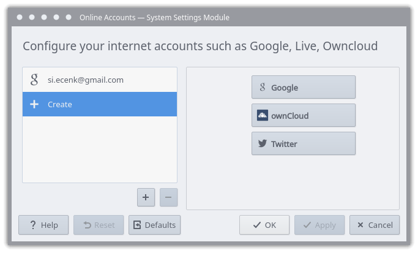
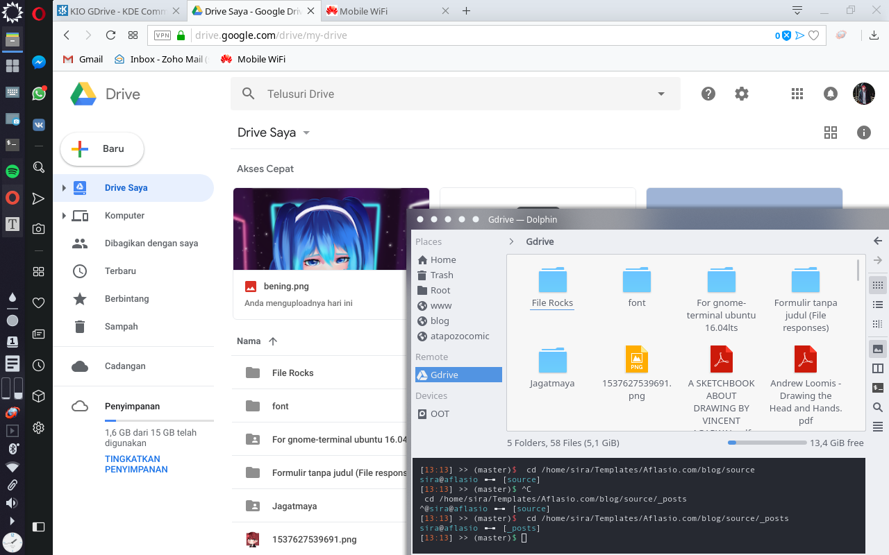

## Pengantar

Sebagai seorang *Digital Artist* yang menerima komisi secara *online*, saya sering mengalami kendala ketika meng-*upload* *file* ke klien. Salah satu di antaranya seperti situs-situs *marketplace* tempat saya bekerja tidak mengizinkan *file* melebihi batas tertentu misalnya 20MB. Untuk masalah ini, saya masih bisa mengakalinya dengan menggunakan tempat simpan *online*, dalam hal ini saya menggunakan Gdrive. 

Nah... sewaktu menggunakan Gdrive pun saya menemukan kendala yang lain merepotkan yaitu saat 60% *upload* (misalnya) tiba-tiba proses terhenti sendiri dan Browser mengatakan bahwa kita sedang *offline* padahal koneksi sedang lancar-lancar saja. Maka dari itu, saya *browsing* mencari cara alternatif *upload* ke Gdrive tanpa harus memindahkan *file* dari PC/Laptop ke *smartphone* Android lalu meng-*upload* kembali menggunakan aplikasi Gdrive. Saya menemukan sebuah solusi yang menurut saya ini simpel dan asyik karena kita hanya perlu login lalu *files* kita yang ada di Gdrive secara otomatis ter-*synchrone* ke File Manager yaitu meng-*install* plugin **KIO Gdrive**.

## KIO Gdrive

KIO Gdrive sendiri adalah sebuah plugin yang memungkinkan kita untuk mengakses dan mengedit *file* yang ada di Gdrive. Cara install-nya bisa melalui Cli atau Synaptic.
```bash
sudo apt install kio-gdrive kaccounts-integration kaccounts-providers
```

Lalu buka **Online Account** dari Menu. Tambahkan akun google anda di sana.



Setelah selesai, cukup jalankan perintah di bawah ini di Terminal dan *file* anda yang ada di Gdrive secara otomatis ter-*synchrone* ke File Manager.

```bash
kioclient5 exec gdrive:/
```


Untuk meng-*upload file*, cukup `copy-paste` *directory* atau *single file* anda ke sana.

Cheer...

> Jika ada kesalahan kata-kalimat dalam artikel ini mohon beri tahu saya, bisa lewat komentar atau kontak di halaman [about](https://blog.aflasio.com/about). Terimakasih.