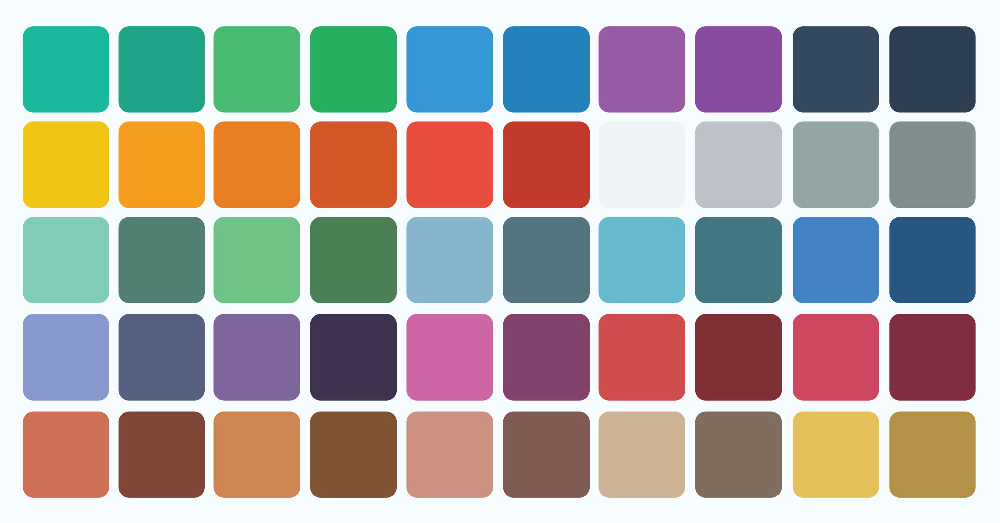

This is flat color palette for inkscape that i make with `picking colors` from the internet.

### Install

[<button name="button">Download Here</button>](/assets/FlatbySira.gpl)

### Windows
Copy file to `User Name\Program Files\Inkscape\share\palettes`

### Linux Distribution

Copy to home
```bash
cp FlatbySira.gpl ~/.config/inkscape/palettes/
```
or root directory
```bash
sudo cp FlatbySira.gpl /usr/share/inkscape/palettes/
```

### OS X
If you're using OS X, open the Applications folder and `right-click` on the Inkscape application and select `Show Package Contents`. This should open a new Finder window and now you can open the `Contents` folder, then `Resources` and finally `palettes`. You can move or copy your the GPL file into this final folder.

Cheer...

> If you have some troubles, please comment below or contact me on [about page](https://blog.aflasio.com/about).